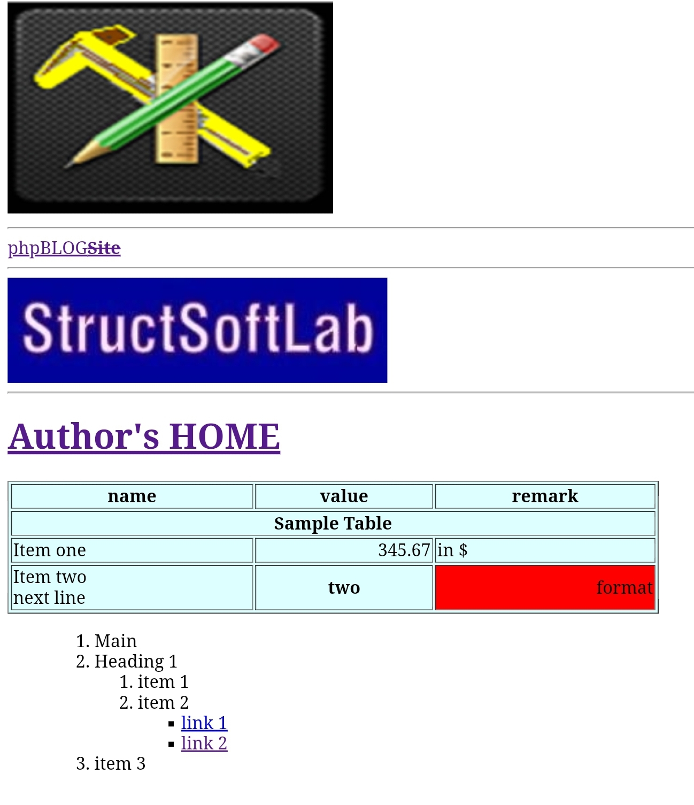

# BBCode-to-HTML-Converter
A class to render BBCode string and convert to HTML string.




## Demo Version
Visit following link and check demo in forum.
[Demo](https://edu.structsoftlab.com/forum/)

## Usage

First include the `BBCode2HTML.php` class in your file, and use the class as following to generate the HTML for the BBCode expressions:

```php
$pist = <<<EOD
[ol/]
[ol]
[li c="blue"]Main[/li]
[li]Heading 1[/li]
[ol]
[li]item 1[/li]
[li]item 2
[ul][li][a ref='http://edu.structsoftlab.com/forum']link 1[/a][/li]
[li][a ref='http://www.structsoftlab.com']link 2[/a] [/li]
[/ul][/li]
[/ol]
[li]item 3[/li]
[/ol]
EOD;

$bb2html = new BBCode2HTML();
echo $bb2html->parse($post);
```

## Features
Algorythm is very simple.

- String is recursively tokenized using `preg_match` into array of matches, 
- Matches types are tag, attributes and inner-html.
- Tag ommitting can be detected.
- Data base classes are formed for each tags.
- Tags data are then converted to html while filtering allowed tags and allowed attributes.
- Value names of attributes are converted through short-cut name list.
- `allowattr` flag control to allow native attributes of html.
## Contact
Contact me for comercial use via mail winaungcho@gmail.com.
